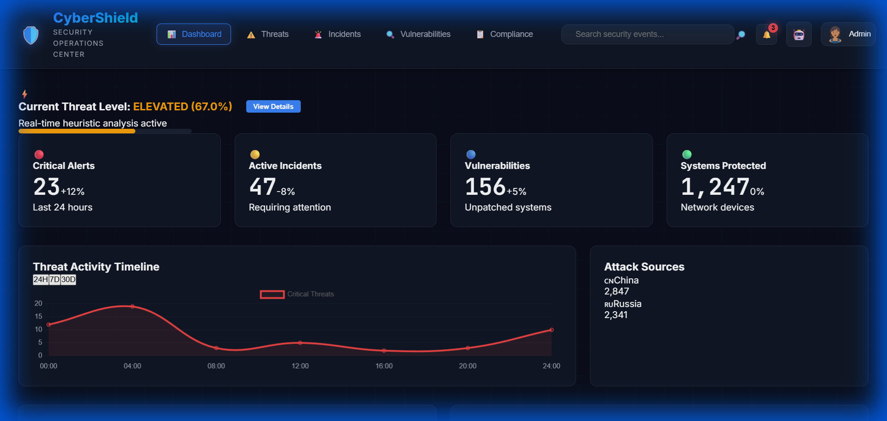
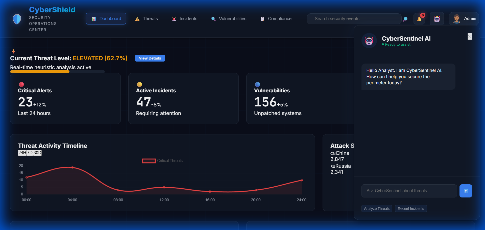
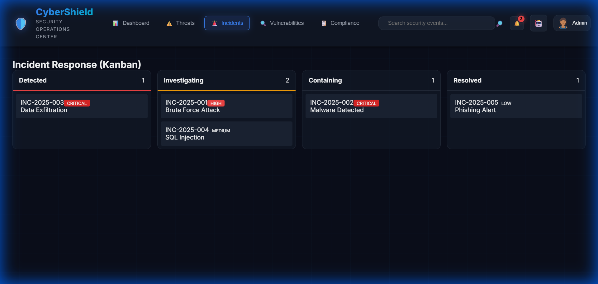

# CyberShield Modern - Security Operations Center (SOC) Platform
🛡️ **State-of-the-Art Cybersecurity Dashboard**

[]()
[]()
[]()

**CyberShield Modern** is a state-of-the-art, high-performance Security Operations Center (SOC) dashboard built with **Angular**. It provides security analysts with a real-time, unified view of their organization's security posture, combining dynamic visualizations, live log streaming, and incident management in a premium, responsive interface.

## 🕹️ Live Preview

### 🖥️ Unified SOC Dashboard
View the live dashboard: [CyberShield SOC - Live](https://raphasha27.github.io/cybershield-modern/)



---

## ✨ Key Features & AI Insights

-   **🤖 CyberSentinel AI Assistant**: A dedicated AI sidekick for real-time threat analysis and rapid security insights.
-   **📈 Real-time Monitoring**: A live "Threat Level" gauge that fluctuates based on incoming heuristic data.
-   **📑 Interactive Metrics**: View critical alerts, active incidents, and vulnerabilities at a glance.
-   **📟 Live Log Stream**: An integrated terminal simulating real-time system logs with color-coded severity.
-   **📋 Incident Kanban**: Manage security incidents through their lifecycle (Detected → Investigating → Containing → Resolved).
-   **🛡️ Glassmorphism Design**: A premium, futuristic dark-mode UI optimized for SOC environments.

## 📸 Comprehensive Screenshots

### 🤖 CyberSentinel AI (Chat Interface)


### 🚨 Incident Response (Kanban Board)


### 🛡️ Threat Intelligence Center


## 🚀 Technology Stack
-   **Framework**: [Angular](https://angular.io/) (Latest Version)
-   **State Management**: [Angular Signals](https://angular.io/guide/signals)
-   **Data Visualization**: [Chart.js](https://www.chartjs.org/)
-   **Typography**: Inter & JetBrains Mono
-   **Styling**: Pure CSS3 with CSS Variables for theme management

## 🛠️ Installation & Setup

### Prerequisites
-   Node.js (v18.x or higher)
-   npm (v9.x or higher)
-   Angular CLI (`npm install -g @angular/cli`)

### Steps to Run
1.  **Clone the Repository**:
    ```bash
    git clone https://github.com/Raphasha27/cybershield-modern.git
    cd cybershield-modern
    ```
2.  **Install Dependencies**:
    ```bash
    npm install
    ```
3.  **Start the Development Server**:
    ```bash
    npm start
    ```
4.  **Access the Application**: Open your browser and navigate to `http://localhost:4200`

## 🌌 One-Branch Fusion Workflow (Keep All History)

If you want a single branch timeline (for example `main`) while preserving every commit from your other branches, run:

```bash
bash scripts/one-branch-fusion.sh main origin
```

What this does:
- Checks out (or creates) `main`.
- Merges every other local branch with `--no-ff` so history remains visible.
- Prints a clean graph view so you can *see* unified history immediately.
- Shows optional cleanup and push commands.

Use this to keep one branch on GitHub without losing the story of your work.

## 📊 Live Simulation
The application includes a built-in simulation engine (`SecurityService`) that generates:
-   Fluctuating threat levels based on random heuristic patterns.
-   A continuous stream of security logs in the integrated terminal.
-   Interactive Chart.js updates upon view switching.

## 📝 Modernization Details
This version represents a significant architectural upgrade from the original vanilla JS implementation:
-   **Encapsulation**: Logical components are managed via standalone Angular components.
-   **Reactivity**: Signals ensure the UI stays in perfect sync with the security data without expensive change detection cycles.
-   **Service-Oriented**: All data logic is centralized in a singleton service, allowing for easy integration with real-world APIs in the future.

---
Developed with ❤️ for the Cybersecurity Community. Visit [Raphasha27 Profile](https://github.com/Raphasha27)
