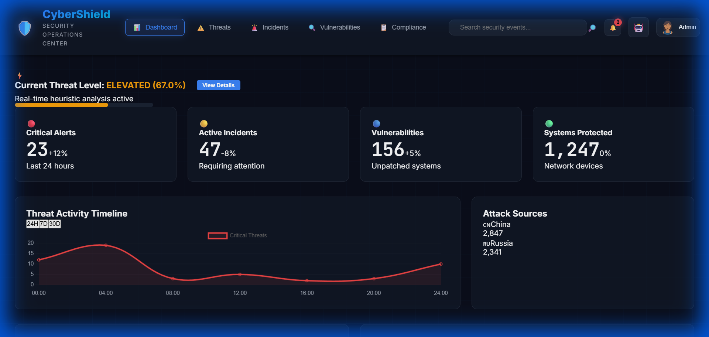
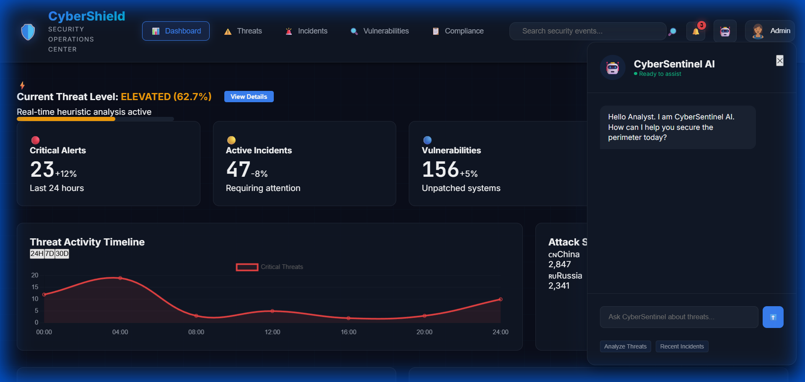
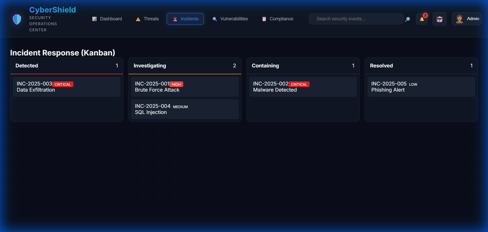
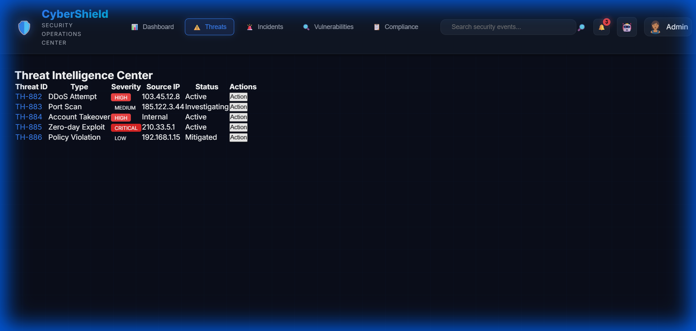

# CyberShield Modern - Total Cyber Defense SOC Platform
🛡️ **Premium, Mission-Critical Security Operations Center by Kirov Dynamics**

[]()
[]()
[](https://github.com/Raphasha27)

**CyberShield Modern** is an ultra-premium, high-performance Security Operations Center (SOC) dashboard developed by **Kirov Dynamics**. It delivers a mission-critical "Total Cyber Defense" experience, combining real-time heuristic monitoring, AI-driven threat detection, and advanced identity integrity scanning into a stunning glassmorphism interface.

## 🕹️ Live Preview

### 🖥️ Mission Control Terminal
View the live platform: [CyberShield SOC - Total Defense](https://raphasha27.github.io/cybershield-modern/)



---

## ✨ Key Features & Neural Insights

-   **🤖 Kirov CyberSentinel AI v3.5**: Intelligent threat response partner for real-time analysis and rapid remediation.
-   **🧠 Neural Engine v4.2**: Advanced Machine Learning model for behavioral monitoring with ultra-high confidence metrics.
-   **🔍 Identity Integrity Scan**: ML-powered deep-web audit for sensitive personal data (Email, ID, Phone) to detect breaches.
-   **📈 Heuristic Threat Level**: A dynamic mission-critical gauge that responds to real-time network entropy.
-   **📟 Premium SIEM Terminal**: Integrated terminal simulating live system logs with high-fidelity color coding.
-   **📋 Incident Orchestration**: Full-lifecycle Kanban board for security incident tracking and mitigation.
-   **💎 Kirov Sovereign Design**: A premium, futuristic dark-mode UI featuring advanced glassmorphism and motion graphics.

## 📸 Comprehensive Screenshots

### 🤖 CyberSentinel AI (Chat Interface)


### 🚨 Incident Response (Kanban Board)


### 🛡️ Threat Intelligence Center


## 🚀 Technology Stack
-   **Framework**: [Angular](https://angular.io/) (Latest Version)
-   **State Management**: [Angular Signals](https://angular.io/guide/signals)
-   **AI/ML Logic**: Simulated Neural Pattern Recognition Engine
-   **Data Visualization**: [Chart.js](https://www.chartjs.org/)
-   **Typography**: Inter & JetBrains Mono
-   **Styling**: Pure CSS3 with CSS Variables for theme management

## 🛠️ Installation & Setup

### Prerequisites
-   Node.js (v18.x or higher)
-   npm (v9.x or higher)
-   Angular CLI (`npm install -g @angular/cli`)

### Steps to Run
1.  **Clone the Repository**:
    ```bash
    git clone https://github.com/Raphasha27/cybershield_soc.git
    cd cybershield_soc
    ```
2.  **Install Dependencies**:
    ```bash
    npm install --legacy-peer-deps
    ```
3.  **Start the Development Server**:
    ```bash
    npm start
    ```
4.  **Access the Application**: Open your browser and navigate to `http://localhost:4200`

## 📊 Live Simulation
The application includes a built-in simulation engine (`SecurityService`) that generates:
-   Fluctuating threat levels based on random heuristic patterns.
-   A continuous stream of security logs in the integrated terminal.
-   Machine Learning model training simulations and identity scanning results.
-   Interactive Chart.js updates upon view switching.

## 📝 Modernization Details
This version represents a significant architectural upgrade by **Kirov Dynamics**:
-   **Encapsulation**: Logical components are managed via standalone Angular components.
-   **Reactivity**: Signals ensure the UI stays in perfect sync with the security data.
-   **Enterprise Ready**: Integrated features for personal data checkups and machine learning status monitoring.

---
Developed by **Kirov Dynamics**. Visit [Raphasha27 Profile](https://github.com/Raphasha27)
