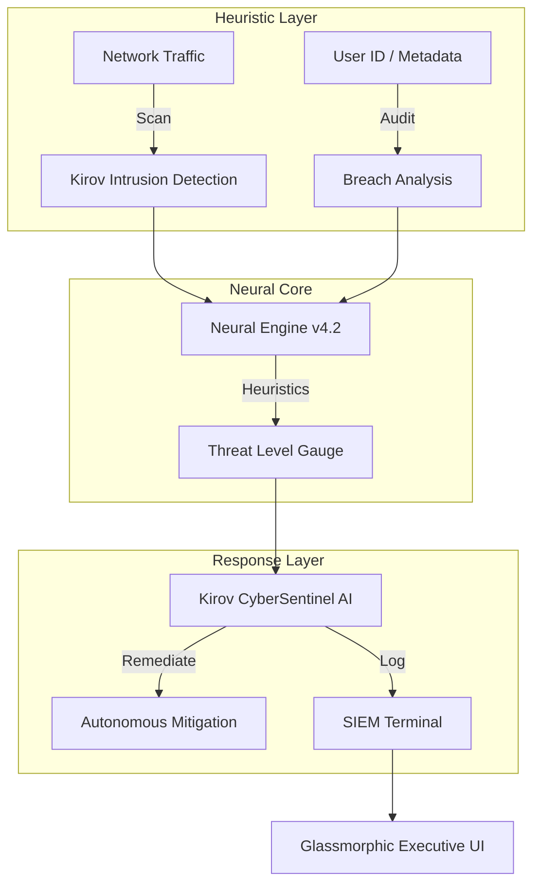

# 🏛️ KIROV DYNAMICS | CYBERSHIELD SOC

🛡️ **Total Defense Security Operations Center**

[](https://github.com/Raphasha27)
[](https://github.com/Raphasha27/Health-Hub)

> **"Mission-Critical Infrastructure Protection."**

---

## 🕹️ Live Preview

### 🖥️ Mission Control Terminal
View the live platform: [CyberShield SOC - Total Defense](https://portfolio-react-zeta-black-48.vercel.app/)

> If you maintain the live site from **repo-Portfolio**, keep that repository URL synchronized below to avoid README 404s.

---


## 🧠 Skills & Project Intelligence

Core profile and repository links:
- Profile: https://github.com/Raphasha27
- Repositories: https://github.com/Raphasha27?tab=repositories
- Portfolio repository: https://github.com/Raphasha27/repo-Portfolio
- CyberShield SOC repository: https://github.com/Raphasha27/cybershield_soc

---

## 🏗️ Architecture & Flow

The CyberShield SOC follows a centralized heuristic monitoring architecture.


```mermaid
graph TD
    subgraph "Heuristic Layer"
        Traffic[Network Traffic] -->|Scan| IDS[Kirov Intrusion Detection]
        Identity[User ID / Metadata] -->|Audit| Breach[Breach Analysis]
    end

    subgraph "Neural Core"
        IDS --> Engine[Neural Engine v4.2]
        Breach --> Engine
        Engine -->|Heuristics| Level[Threat Level Gauge]
    end

    subgraph "Response Layer"
        Level --> Sentinel[Kirov CyberSentinel AI]
        Sentinel -->|Remediate| Action[Autonomous Mitigation]
        Sentinel -->|Log| Terminal[SIEM Terminal]
    end

    Terminal --> Dashboard[Glassmorphic Executive UI]
```

---

## ✨ Features

- **🤖 Kirov CyberSentinel AI**: Intelligent threat response partner for real-time analysis and rapid remediation.
- **🔍 Identity Integrity Scan**: Deep-web audit for sensitive personal data to detect and flag breaches.
- **📈 Heuristic Threat Level**: Dynamic gauge responding to network entropy and behavioral anomalies.
- **📟 Premium SIEM Terminal**: High-fidelity terminal simulating live logs with advanced color coding.
- **💎 Kirov Sovereign Design**: Futuristic dark-mode UI with glassmorphism and sub-pixel motion graphics.

---

## 🛠️ Technology Stack

| Component | Technology |
| :--- | :--- |
| **Framework** | Angular (Latest) with Signals |
| **Visualization** | Chart.js & D3.js |
| **Security** | Heuristic Pattern Recognition Engine |
| **Styling** | Modular CSS3 with Neon Tokens |
| **Hardening** | Health Hub Status Injection |

---

## 🚀 Installation

```bash
# Clone the repository
git clone https://github.com/Raphasha27/cybershield_soc.git

# Install & Run
npm install
npm start
```

---

## 📜 License
© 2026 **Kirov Dynamics**. All Rights Reserved.

---
*Architected and Engineered by Raphasha27 - Kirov Dynamics 2026.*
